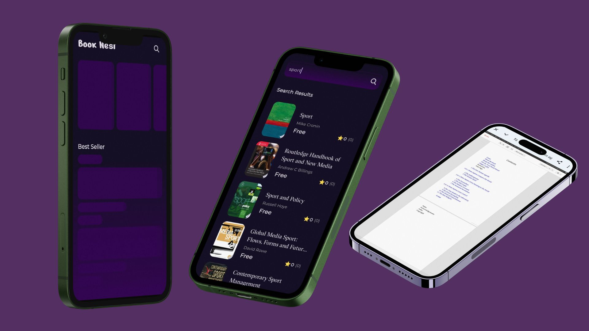
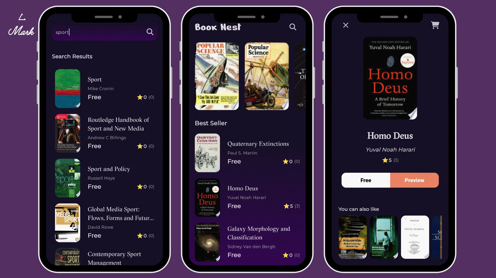
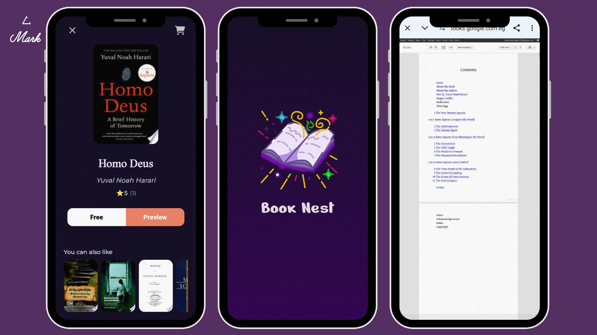

BookNest

BookNest is an elegant and high-performance mobile application built with Flutter, designed to provide users with seamless access to free book previews via the Google Books API. The app delivers a smooth, visually appealing experience with clean architecture and animations for a dynamic user interface.

BookNest emphasizes an intuitive user journey by offering a splash screen, home page featuring the latest and most popular books, detailed book pages, and an advanced search functionality. The application is structured using the MVVM design pattern, leveraging Bloc Cubit for state management to ensure scalability and maintainability.

---

🚀 Features

Splash Screen: A visually captivating animated introduction screen.

Home Page: Displays the newest releases and featured books, dynamically fetched from the Google Books API.

Book Details Page: Provides detailed information about each book, along with a button to preview the book content.

Search Page: Empowers users to search for books by title, author, or keyword, integrating real-time results from the Google Books API.

Loading Animations: Smooth and consistent loading animations across all pages for a refined user experience.

---

🛠️ Technologies & Tools

BookNest is developed using modern technologies and best practices in mobile application development, ensuring robustness and flexibility:

Flutter: The core framework for building beautiful UIs natively for Android and iOS.

Bloc Cubit: For efficient state management using unidirectional data flow.

MVVM (Model-View-ViewModel): Clean architectural pattern for separation of concerns, ensuring maintainable code.

Google Books API: Provides book data and previews.

Key Packages

Dio: A powerful and flexible HTTP client for making API requests.

Dartz: Facilitates functional programming paradigms, including error handling using Either and Option.

Get_it: Dependency injection to maintain clean code and decoupling.

Go_Router: Manages app routing with ease and efficiency.

Url_Launcher: Opens book previews in the user's default browser.

Equatable: Simplifies object equality comparisons, crucial for effective state management.

Cached_Network_Image: Efficient image loading and caching for enhanced performance.

---
📸 Screenshots

 Image 1 | Image 2 |
|---------|---------|
|  |  |

 Image 3 | Image 4 |
|---------|---------|
|  |  |
---

 
⚙️ Installation Guide

To set up the BookNest application locally, follow these steps:

1. Clone the repository:

git clone https://github.com/your-username/booknest.git

2. Navigate to the project directory:

cd book_nest

3. Fetch the project dependencies:

flutter pub get

4. Run the application:

flutter run

Ensure you have the necessary Flutter environment set up. If not, follow the official Flutter installation guide.

---

📝 Usage

Upon launching the app, users are greeted by a custom splash screen with fluid animations.

The home page lists the newest books and featured selections, fetched from the Google Books API.

Users can tap on any book for detailed information and click the "Preview" button to view the book.

The search page allows users to search for books using keywords, authors, or titles.

---

👨‍💻 Architecture

BookNest is designed using the MVVM architecture in combination with Bloc Cubit to manage state efficiently across the application. This ensures clear separation of logic, making the codebase maintainable, testable, and scalable for future enhancements.

---

🤝 Contribution Guidelines

We welcome contributions from developers to enhance the app's functionality, performance, or user interface. To contribute:

1. Fork the repository.

2. Create a new branch for your feature or bug fix:

git checkout -b feature-name

3. Make your changes and commit them:

git commit -m "Add a concise description of the changes"

4. Push the changes to your forked repository:

git push origin feature-name

5. Open a pull request to merge your changes into the main repository.

For substantial changes, please discuss them with the maintainers via an issue or email before proceeding.

---

🛡️ License

This project is licensed under the MIT License – see the LICENSE file for details.

---

📧 Contact Information

For any questions, suggestions, or collaboration opportunities, feel free to reach out via:

Email: your-email@example.com

LinkedIn: Your LinkedIn Profile

---