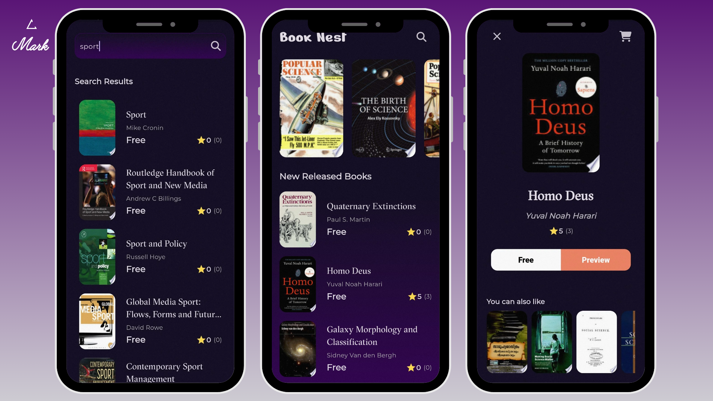

# BookNest

**BookNest** is an elegant and high-performance mobile application built with Flutter, designed to provide users with seamless access to free book previews via the ***Google Books API***. The app delivers a smooth, visually appealing experience with clean architecture and animations for a dynamic user interface. 

BookNest emphasizes an intuitive user journey by offering a splash screen, home page featuring the latest and most popular books, detailed book pages, and an advanced search functionality. The application is structured using the **MVVM** design pattern, leveraging **Bloc Cubit** for state management to ensure scalability and maintainability.

---

## 📸 Screenshots

 Image 1 | Image 2 |
|---------|---------|
|  |  |

 Image 3 | Image 4 |
|---------|---------|
|  |  |

---
## 🚀 Features

- **Splash Screen:** A visually captivating animated introduction screen.
- **Home Page:** Displays the newest releases and featured books, dynamically fetched from the Google Books API.
- **Book Details Page:** Provides detailed information about each book, along with a button to preview the book content.
- **Search Page:** Empowers users to search for books by title, author, or keyword, integrating real-time results from the Google Books API.
- **Loading Animations:** Smooth and consistent loading animations across all pages for a refined user experience.

---

## 🛠️ Technologies & Tools

BookNest is developed using modern technologies and best practices in mobile application development, ensuring robustness and flexibility:

- **Flutter:** The core framework for building beautiful UIs natively for Android and iOS.
- **Bloc Cubit:** For efficient state management using unidirectional data flow.
- **MVVM (Model-View-ViewModel):** Clean architectural pattern for separation of concerns, ensuring maintainable code.
- **Google Books API:** Provides book data and previews.

### Key Packages

- **[Dio](https://pub.dev/packages/dio):** A powerful and flexible HTTP client for making API requests.
- **[Dartz](https://pub.dev/packages/dartz):** Facilitates functional programming paradigms, including error handling using `Either` and `Option`.
- **[Get_it](https://pub.dev/packages/get_it):** Dependency injection to maintain clean code and decoupling.
- **[Go_Router](https://pub.dev/packages/go_router):** Manages app routing with ease and efficiency.
- **[Url_Launcher](https://pub.dev/packages/url_launcher):** Opens book previews in the user's default browser.
- **[Equatable](https://pub.dev/packages/equatable):** Simplifies object equality comparisons, crucial for effective state management.
- **[Cached_Network_Image](https://pub.dev/packages/cached_network_image):** Efficient image loading and caching for enhanced performance.
- 

---

## 🎨 Colors

BookNest uses a specific color palette to maintain a consistent and aesthetically pleasing user interface. Below are the primary colors used in the app:

- **Primary Color:** `#100B20` - Used for backgtound.
- **Secondary Color:** `#2F004E` - Used for highlites.
- **Button Color:** `#EF8262` - Used for app buttons.
- **Text Color:** `#FFFFFF` - Primary text color for readability.

Feel free to adjust these colors to fit your branding or design preferences.

---

## ⚙️ Installation Guide

To set up the BookNest application locally, follow these steps:

1. Clone the repository:
   ```bash
   git clone https://github.com/MarkMagdyShawky/booknest.git
2. Navigate to the project directory:
   ```bash
   cd booknest
3. Fetch the project dependencies:
   ```bash
   flutter pub get
4. Run the application:
   ```bash
   flutter run

-----

## 📝 Usage
- Upon launching the app, users are greeted by a custom splash screen with fluid animations.
- The home page lists the newest books and featured selections, fetched from the Google Books API.
- Users can tap on any book for detailed information and click the "Preview" button to view the book.
- The search page allows users to search for books using keywords, authors, or titles.

----

## 👨‍💻 Architecture
BookNest is designed using the MVVM architecture in combination with Bloc Cubit to manage state efficiently across the application. This ensures clear separation of logic, making the codebase maintainable, testable, and scalable for future enhancements.

----

## 🛡️ License
This project is licensed under the MIT License – see the [LICENSE](LICENSE) file for details.

----

## 👤 Author

This project was designed and developed entirely by ***[Mark Magdy Shawky]***.

For any inquiries, feel free to reach out:

- **Email:** [markmarkmagdy@gmail.com](mailto:markmarkmagdy@gmail.com)
- **LinkedIn:** [mark-magdy-02600923](https://linkedin.com/in/mark-magdy-02600923)
